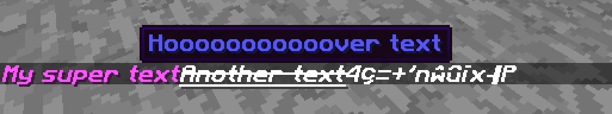

# Minecraft Tellraw generator

This is simple python package that help you to create minecraft tellraw command for yours scripts written in python

### Requirements
This package was only tested on Python 3

### Install
``pip install -U minecraftTellrawGenerator``

### Example
Import module and let's go !
```python
from minecraftTellrawGenerator import MinecraftTellRawGenerator as mctellraw

hover = mctellraw(text='Hooooooooooover text', bold=True, color='blue')

a = mctellraw(
    text='My super text ',
    color='light_purple',
    italic=True,
    bold=True,
    insertion='/say hello',
    click='Hello all !',
    hover=hover
)


b = mctellraw(
    text="Another text ",
    underlined=True,
    strikethrough=True
    )

c = mctellraw(text="JUST FOR FUN", obfuscated=True, bold=True)

# Get output:
print(a)
# Or in certain case you need to cast
print(str(a))

# Get all messages in one:
print(mctellraw.multiple_tellraw(a, b, c))

# OR old / classic method
print('[' + str(a) + ', ' + str(b) + ', ' + str(c) + ']')

```

#### Output example:
```json
[
   {
      "text":"My super text ",
      "color":"light_purple",
      "bold":true,
      "italic":true,
      "insertion":"/say hello",
      "clickEvent":{
         "action":"run_command",
         "value":"Hello all !"
      },
      "hoverEvent":{
         "action":"show_text",
         "value":{
            "text":"Hooooooooooover text",
            "color":"blue",
            "bold":true
         }
      }
   },
   {
      "text":"Another text ",
      "color":"white",
      "underlined":true,
      "strikethrough":true
   },
   {
      "text":"JUST FOR FUN",
      "color":"white",
      "bold":true,
      "obfuscated":true
   }
]
```

##### In game


## Pypi
[https://pypi.python.org/pypi/minecraftTellrawGenerator](https://pypi.python.org/pypi/minecraftTellrawGenerator)

## Authors

Valentin DEVILLE [[Twitter](https://twitter.com/MyTheValentinus)]

License: GPLV3
